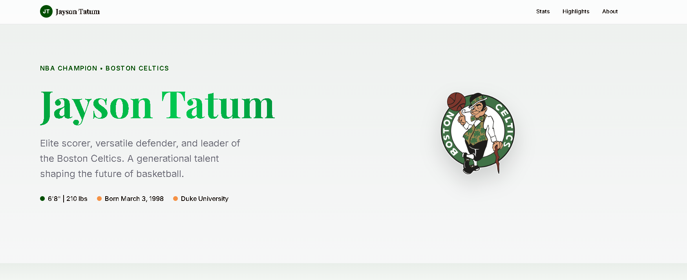

# 🏀 Jayson Tatum Fan Site


A modern, responsive fan website dedicated to Jayson Tatum, NBA Champion and Boston Celtics star.

## 🌐 Live Demo


Visit the live site: **https://iam269.github.io/jaysontatum/**

## 📸 Screenshots




## 📖 About


This is an unofficial fan site celebrating Jayson Tatum's career and achievements. The website features:

- **Hero Section**: Introduction with Jayson Tatum's name and the Boston Celtics logo 🏀
- **Career Statistics**: Detailed stats including points, rebounds, assists, and more 📊
- **Career Highlights**: Key achievements and milestones 🌟
- **About Section**: Background information about Jayson's career 📋
- **Social Media**: Links to official social media accounts 📱

## ⚙️ Tech Stack


- **React 19** - UI framework
- **TypeScript** - Type safety
- **Vite** - Build tool and development server
- **Tailwind CSS** - Styling
- **Framer Motion** - Animations
- **Three.js** - 3D graphics and shaders

## 🚀 Getting Started


### 📋 Prerequisites


- Node.js 18+
- pnpm (recommended) or npm

### 📦 Installation


```bash
# Install dependencies
pnpm install

# Start development server
pnpm dev

# Build for production
pnpm build
```

### 🚀 Deploy to GitHub Pages


1. Create a new GitHub repository
2. Push your code to the repository
3. Go to Repository Settings → Pages
4. Select the `main` branch as the source
5. Set the folder to `dist`
6. Click Save

Or use the CLI:

```bash
# Build and deploy to GitHub Pages
npm run deploy
```

**Note:** Make sure your repository is set to public for free GitHub Pages, or enable GitHub Pages in your repository settings.

## ✨ Features


- 🎨 Beautiful gradient text effects
- 📱 Fully responsive design
- 🏀 Boston Celtics themed green color scheme
- ✨ Smooth animations and transitions
- 🖼️ Three.js shader animations

## 📄 License


This is an unofficial fan site. All NBA player statistics, images, and trademarks belong to their respective owners.

See [LICENSE](LICENSE) for more details.

## 🙏 Credits


- Jayson Tatum - NBA Player
- Boston Celtics - NBA Team
- Built with React, TypeScript, and Tailwind CSS
